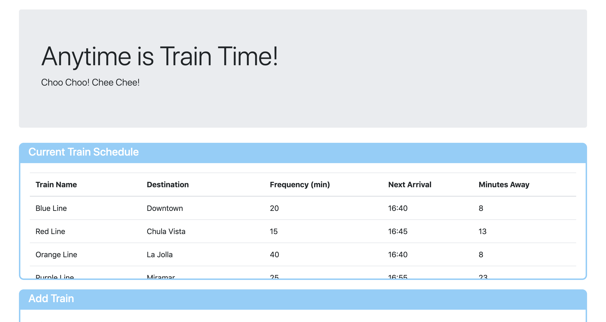

# Train-Scheduler
A front-end train scheduling application utilizing `Firebase`and `Moment.js`

## Overview
Train Scheduler accepts user input to new train information inlcuding a train name, start time, and frequency of arrival. The new train info is stored in a Firebase database and rendered on the page in the in the "Current Train Schedule" window on load. Schedules will refresh when the page is refreshed to reflect updated arrival information using Moment.js.

[See the application!](https://sweetmike.github.io/Train-Scheduler/)

## Sample View

## Technologies
- HTML5
- CSS3
- JavaScript
- JQuery
- Firebase
- Moment.js

